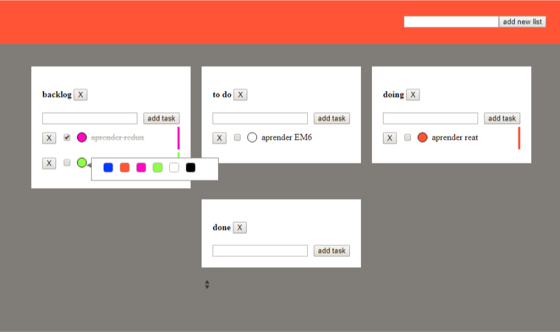

#  Scrum Board with React

## Uso

Después de clonarlo en local ejecutar `npm install` para instalar las dependencias.

Ejecutar `npm star` para levantar el servidor de desarrollo con hot reloading.

## Features

- [x] Diseño responsive
- [x] Añadir listas nuevas
- [x] Añadir tareas a las listas
- [x] Guardar el estado en localStorage
- [x] Borrar listas
- [x] Marcar tarea como completada

Para ser realizadas por los alumnos:

- [ ] Borrar tareas 
- [ ] Cambiar el color de las tareas individualmente (buscar un componente de terceros de color-picker)
- [ ] Editar texto de la tarea.
- [ ] Cambiar el tareas de lista arrastrándolas (drag and drop native o buscar algún componente de terceros)
- [ ] Cambiar las tareas de orden (plugins recomendado: [React sortable hoc](https://github.com/clauderic/react-sortable-hoc) o [react-beautiful-dnd](https://github.com/atlassian/react-beautiful-dnd)
- [ ] Migrar la gestión del estado a redux

## Objetivo final

## Boilerplate

This project was bootstrapped with [Create React App](https://github.com/facebookincubator/create-react-app).
